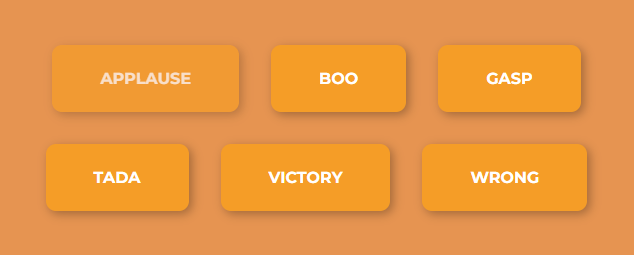

# 🔊 Sound Stream Deck Buttons

A fun and interactive **Sound Stream Deck** project where each button plays a unique sound effect on click.
Built using **HTML**, **CSS**, and **JavaScript**.

---

## ✨ Features

* Multiple sound buttons (e.g. 🎉 *Tada*, 👏 *Applause*, 😒 *Boo*, etc.)
* Play sound on button click
* Clean, responsive designs

---

## 🎥 Preview

<p align="center">
  
  
</p>

---

## 📦 Setup

```bash
# Clone the repository
git clone https://github.com/yigitkagankartal/soundStreamDeck.git

⭐ Enjoy triggering your favorite sound effects!
